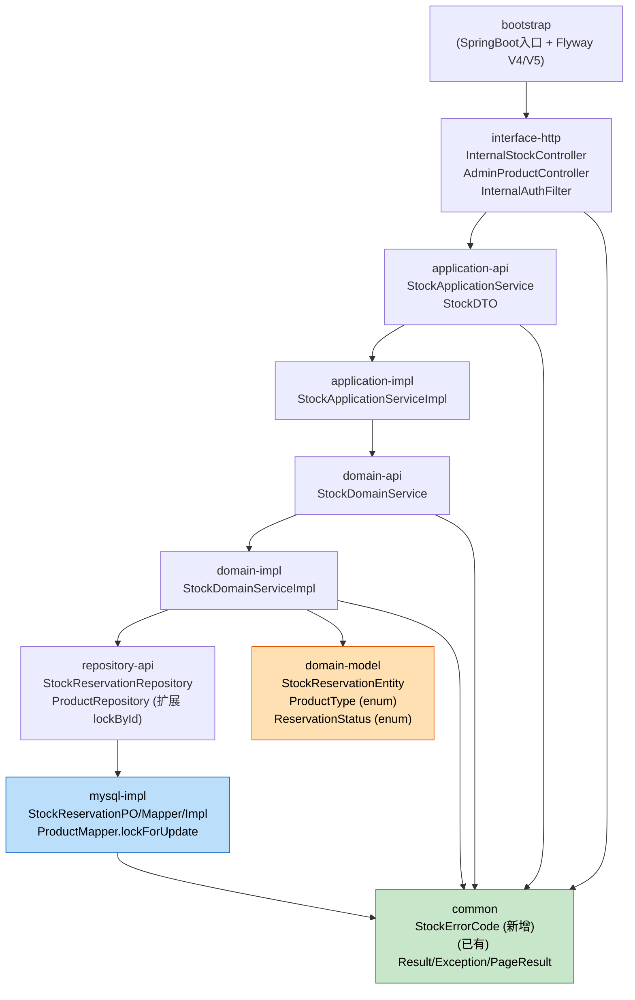
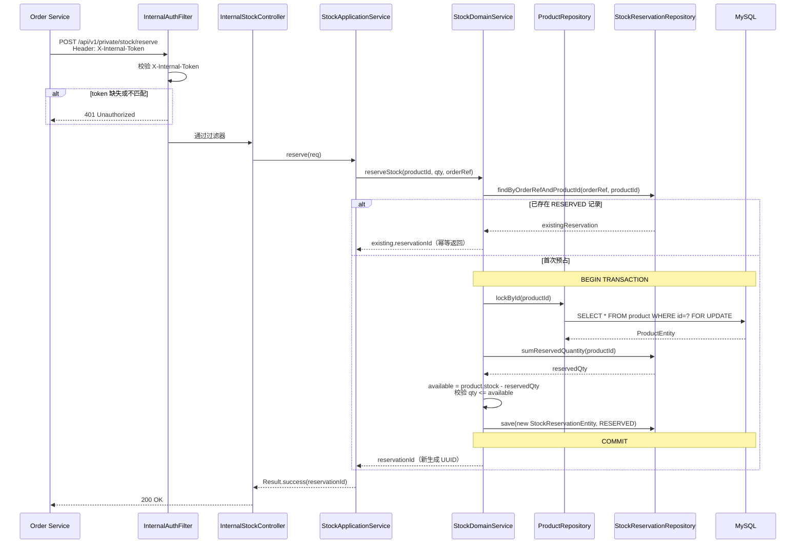
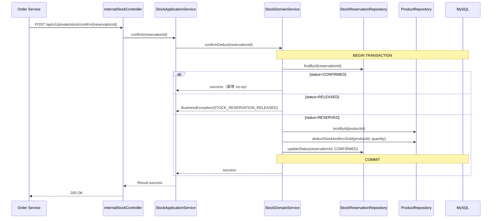
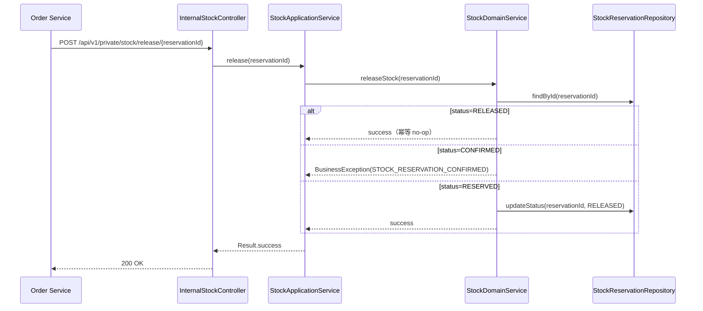

# Design Document

> Feature: product-stock-reservation-api（已扩展为 Product Service 模块级）
> 关联需求：requirements.md（Requirement 1–16）
> 关联应用设计：awsome-shop-plan/aidlc-docs/inception/application-design/

---

## Overview

本设计将 P0 范围内的三项能力（商品类型字段、库存预占内部接口与状态机、内网鉴权过滤器）落地到现有 `awsome-shop-product-service` 仓库的 DDD + 六边形多模块结构中，复用既有的 common 错误码体系、PO/Mapper 范式、Flyway 迁移目录和全局异常处理。本设计与 `awsome-shop-plan` 应用设计四份产出物（components.md / component-methods.md / services.md / component-dependency.md）逐节对齐，作为 Order Service 调用的契约依据。

设计原则：
- **不新增 Maven 模块**，仅在既有模块下按 `<layer>.stock.<class>` 包路径增加类。
- **不破坏现有 Product 流程**：`/api/v1/public/product/list|create` 行为保持兼容，仅在 ProductDTO 中追加 `productType` 字段。
- **悲观锁路径与现有乐观锁拦截器隔离**：reserve 走 Mapper XML 中显式 `SELECT ... FOR UPDATE`，不经 `Wrapper`，避免被 `OptimisticLockerInnerInterceptor` 干扰。
- **内网鉴权使用最轻量的共享密钥头方案**（`X-Internal-Token`），实现为 `OncePerRequestFilter`，不引入 Spring Security 依赖。
- **URL 命名遵循既有约定**：内部接口使用 `/api/v1/private/stock/<action>`（参见 `layer-interface.md` URL 设计规范）；管理端使用 `/api/v1/public/product/<action>` 体系（既有公开端点 + 调整库存）。

> **命名约定澄清**：requirements.md 中以 `/internal/stock/**` 表达"内部"语义，本设计映射为现有规范的 `/api/v1/private/stock/**`。Internal_Auth_Filter 拦截路径更新为 `/api/v1/private/**`。两者在功能与鉴权语义上等价，差异仅为路径命名风格。

---

## Architecture

### 模块依赖图（Mermaid）



### 文本替代

```
bootstrap (SpringBoot入口 + Flyway V4/V5)
  └── interface-http (InternalStockController, AdminProductController, InternalAuthFilter)
        └── application-api (StockApplicationService, StockDTO)
              └── application-impl (StockApplicationServiceImpl)
                    └── domain-api (StockDomainService)
                          └── domain-impl (StockDomainServiceImpl)
                                ├── repository-api (StockReservationRepository, ProductRepository.lockById)
                                │     └── mysql-impl (StockReservationPO/Mapper/Impl, ProductMapper.lockForUpdate)
                                └── domain-model (StockReservationEntity, ProductType, ReservationStatus)

common (横向依赖) ← 全部模块依赖
  ├── StockErrorCode (新增)
  └── (已有) Result / BusinessException / ParameterException / PageResult
```

### 包路径映射（按 Maven 模块）

| Maven 模块 | 新增/修改类 |
|---|---|
| `common` | 新增 `com.awsome.shop.product.common.enums.StockErrorCode` |
| `domain/domain-model` | 新增 `com.awsome.shop.product.domain.model.product.ProductType`（enum）<br>新增 `com.awsome.shop.product.domain.model.stock.ReservationStatus`（enum）<br>新增 `com.awsome.shop.product.domain.model.stock.StockReservationEntity`<br>修改 `ProductEntity`：新增 `productType` 字段 |
| `domain/domain-api` | 新增 `com.awsome.shop.product.domain.service.stock.StockDomainService` |
| `domain/domain-impl` | 新增 `com.awsome.shop.product.domain.impl.service.stock.StockDomainServiceImpl` |
| `domain/repository-api` | 新增 `com.awsome.shop.product.repository.stock.StockReservationRepository`<br>修改 `ProductRepository`：新增 `lockById(Long)` 与 `adjustStock(Long, Integer)` |
| `infrastructure/repository/mysql-impl` | 新增 `repository.mysql.po.stock.StockReservationPO`<br>新增 `repository.mysql.mapper.stock.StockReservationMapper`<br>新增 `repository.mysql.impl.stock.StockReservationRepositoryImpl`<br>修改 `repository.mysql.mapper.product.ProductMapper`：新增 `selectByIdForUpdate`<br>修改 `repository.mysql.impl.product.ProductRepositoryImpl`：实现 `lockById` / `adjustStock` |
| `application/application-api` | 新增 `application.api.dto.stock.*`（请求/响应 DTO）<br>新增 `application.api.service.stock.StockApplicationService`<br>新增 `application.api.dto.product.request.AdjustStockRequest`<br>修改 `application.api.dto.product.ProductDTO`：新增 `productType`<br>修改 `application.api.dto.product.request.CreateProductRequest`：新增 `productType` 校验 |
| `application/application-impl` | 新增 `application.impl.service.stock.StockApplicationServiceImpl`<br>修改 `application.impl.service.product.ProductApplicationServiceImpl`：在 toDTO 中映射 productType；新增 adjustStock 用例 |
| `interface/interface-http` | 新增 `facade.http.controller.InternalStockController`<br>新增 `facade.http.controller.AdminProductController`（仅承载 adjustStock）<br>新增 `facade.http.filter.InternalAuthFilter`<br>新增 `facade.http.config.InternalAuthFilterConfig` |
| `bootstrap` | 新增 `db/migration/V4__add_product_type_to_product.sql`<br>新增 `db/migration/V5__create_stock_reservation_table.sql`<br>修改 `application.yml`：新增 `awsomeshop.internal-auth.token` 配置项 |

### Saga 协作时序（对齐 services.md 2.2 / 2.3）

#### 兑换正向：reserve（成功路径）



#### 发货扣减：confirm（实物履约）



#### 兑换补偿：release（取消/Saga 回滚）



---

## Components and Interfaces

### Interface 层（interface-http）

#### InternalStockController

| HTTP 方法 + 路径 | 方法签名 | 说明 | 关联 AC |
|---|---|---|---|
| `POST /api/v1/private/stock/get` | `Result<StockQueryResponse> getStock(@RequestBody @Valid StockQueryRequest req)` | 查询商品可用库存与 productType；body 含 `productId` | Req 2 AC-2.1~2.4 |
| `POST /api/v1/private/stock/reserve` | `Result<ReserveStockResponse> reserve(@RequestBody @Valid ReserveStockRequest req)` | 创建/幂等返回 Stock_Reservation；返回 `reservationId` | Req 3 AC-3.1~3.6, Req 4 AC-4.1~4.4 |
| `POST /api/v1/private/stock/release` | `Result<Void> release(@RequestBody @Valid ReleaseStockRequest req)` | 释放预占；body 含 `reservationId` | Req 5 AC-5.1~5.6 |
| `POST /api/v1/private/stock/confirm` | `Result<Void> confirm(@RequestBody @Valid ConfirmStockRequest req)` | 正式扣减；body 含 `reservationId` | Req 6 AC-6.1~6.5 |

> 全部使用 `@PostMapping` 与 `@RequestBody`，符合 `layer-interface.md` URL 设计规范。Path 中不含变量。

#### AdminProductController

| HTTP 方法 + 路径 | 方法签名 | 说明 | 关联 AC |
|---|---|---|---|
| `POST /api/v1/public/product/adjust-stock` | `Result<Void> adjustStock(@RequestBody @Valid AdjustStockRequest req)` | 管理员将指定 productId 的 stock 设为 newQty（绝对值替换） | Req 9 AC-9.1~9.5 |

> 该端点位于 `public` scope（前端管理界面通过 API Gateway 调用），鉴权由 Gateway 的 `RoleAuthorizationFilter` 校验 ADMIN 角色（参见 components.md §5）。

#### InternalAuthFilter

```java
@Component
public class InternalAuthFilter extends OncePerRequestFilter {
    private static final String INTERNAL_PATH_PREFIX = "/api/v1/private/";
    private static final String TOKEN_HEADER = "X-Internal-Token";

    @Value("${awsomeshop.internal-auth.token}")
    private String expectedToken;

    @Override
    protected void doFilterInternal(HttpServletRequest req, HttpServletResponse resp,
                                    FilterChain chain) throws ServletException, IOException;

    @Override
    protected boolean shouldNotFilter(HttpServletRequest req);  // 仅对 /api/v1/private/** 生效
}
```

| 行为 | 关联 AC |
|---|---|
| `shouldNotFilter` 对非 `/api/v1/private/**` 返回 true，跳过过滤 | Req 10 AC-10.1, AC-10.5 |
| 请求头 `X-Internal-Token` 缺失或与配置值不一致 → 写入 `Result.error(AUTH_*)` JSON 并返回 401 | Req 10 AC-10.3 |
| token 校验通过 → `chain.doFilter()` | Req 10 AC-10.2 |
| 拒绝时通过 Slf4j 输出结构化日志 `{path, reason, remoteAddr}` | Req 10 AC-10.6 |

#### InternalAuthFilterConfig

```java
@Configuration
public class InternalAuthFilterConfig {
    @Bean
    public FilterRegistrationBean<InternalAuthFilter> internalAuthFilter(InternalAuthFilter filter) {
        FilterRegistrationBean<InternalAuthFilter> reg = new FilterRegistrationBean<>(filter);
        reg.addUrlPatterns("/api/v1/private/*");
        reg.setOrder(Ordered.HIGHEST_PRECEDENCE + 10);
        return reg;
    }
}
```

### Application 层（application-api / application-impl）

#### StockApplicationService（接口）

```java
public interface StockApplicationService {
    StockQueryResponse getAvailableStock(Long productId);
    ReserveStockResponse reserve(ReserveStockRequest req);
    void release(String reservationId);
    void confirm(String reservationId);
}
```

#### StockApplicationServiceImpl（实现）

| 职责 | 说明 |
|---|---|
| 参数校验 | Bean Validation（在 Request 上）+ 调用前的业务前置校验（如 quantity > 0） |
| 委托领域服务 | 调用 `StockDomainService` 完成实际业务 |
| Entity → DTO 转换 | 私有 `toResponse()` 方法构建响应 DTO |
| 事务边界 | 不在此层加 `@Transactional`，由 Domain Impl 控制（reserve / confirm 需要悲观锁事务） |

#### ProductApplicationServiceImpl 的修改点

| 修改 | 说明 | 关联 AC |
|---|---|---|
| `toDTO` 增加 `productType` 字段映射 | ProductEntity.productType → ProductDTO.productType | Req 1 AC-1.4 |
| 新增 `adjustStock(AdjustStockRequest)` 用例 | 校验 newQty ≥ 0 → 调用 `productDomainService.adjustStock(productId, newQty)` | Req 9 AC-9.1~9.5 |
| `createProduct` 在 toEntity 前校验 productType ∈ {PHYSICAL, VIRTUAL} | 通过 Bean Validation `@Pattern` 完成 | Req 1 AC-1.2, AC-1.3 |

#### Application DTO

| 类 | 包路径 | 字段 |
|---|---|---|
| `StockQueryRequest` | `application.api.dto.stock.request` | `Long productId` (`@NotNull`) |
| `StockQueryResponse` | `application.api.dto.stock` | `Long productId, Integer availableStock, ProductType productType` |
| `ReserveStockRequest` | `application.api.dto.stock.request` | `Long productId` (`@NotNull`), `Integer quantity` (`@NotNull` `@Min(1)`), `String orderRef` (`@NotBlank` `@Size(max=64)`) |
| `ReserveStockResponse` | `application.api.dto.stock` | `String reservationId` |
| `ReleaseStockRequest` | `application.api.dto.stock.request` | `String reservationId` (`@NotBlank`) |
| `ConfirmStockRequest` | `application.api.dto.stock.request` | `String reservationId` (`@NotBlank`) |
| `AdjustStockRequest` | `application.api.dto.product.request` | `Long productId` (`@NotNull`), `Integer newQty` (`@NotNull` `@Min(0)`) |
| `ProductDTO`（修改） | `application.api.dto.product` | 新增字段 `String productType` |
| `CreateProductRequest`（修改） | `application.api.dto.product.request` | 新增字段 `String productType`：`@NotBlank` + `@Pattern(regexp = "PHYSICAL\|VIRTUAL")` |

### Domain 层（domain-api / domain-impl）

#### StockDomainService（接口，对齐 component-methods.md §2 StockService）

```java
public interface StockDomainService {

    /** 查询可用库存 = product.stock - SUM(reservations[RESERVED].quantity) */
    int getAvailableStock(Long productId);

    /**
     * 悲观锁预占：以 (orderRef, productId) 幂等。
     * 1) 先按 (orderRef, productId) 查找已存在记录，存在则直接返回该 reservationId；
     * 2) 不存在则在事务内 SELECT product FOR UPDATE，校验可用库存，写入 RESERVED 行。
     */
    String reserveStock(Long productId, int quantity, String orderRef);

    /** RESERVED → RELEASED；RELEASED no-op；CONFIRMED 抛业务异常。 */
    void releaseStock(String reservationId);

    /** RESERVED → CONFIRMED 并扣减 product.stock 与累加 sold_count；CONFIRMED no-op；RELEASED 抛业务异常。 */
    void confirmDeduct(String reservationId);
}
```

#### ProductDomainService（既有接口的扩展点）

| 新增方法 | 签名 | 说明 |
|---|---|---|
| `adjustStock` | `void adjustStock(Long productId, int newQty)` | 在事务内将 product.stock 设为 newQty（绝对值替换），不影响已有 Stock_Reservation |

#### StockDomainServiceImpl 关键逻辑

| 方法 | 关键实现 | 关联 AC |
|---|---|---|
| `getAvailableStock` | 1. `productRepository.getById(id)` → 不存在抛 BIZ_NOT_FOUND<br>2. `stockReservationRepository.sumReservedQuantity(productId)`<br>3. 返回 `product.stock - reservedSum` | Req 2 |
| `reserveStock` | `@Transactional`（默认 REQUIRED）<br>1. 校验 `quantity > 0` 与 `orderRef` 非空（防御）<br>2. 幂等查询：`findByOrderRefAndProductId(orderRef, productId)`<br>　- 命中且 quantity 一致 → 返回已有 reservationId<br>　- 命中但 quantity 冲突 → 抛 BIZ_RESERVATION_CONFLICT<br>3. 未命中：`productRepository.lockById(productId)`（FOR UPDATE）<br>4. 计算 available；qty > available → 抛 BIZ_STOCK_INSUFFICIENT<br>5. 生成 `reservationId = UUID.randomUUID().toString()`<br>6. `stockReservationRepository.save(new RESERVED entity)` | Req 3, Req 4, Req 7 |
| `releaseStock` | `@Transactional`<br>1. `findById(reservationId)` → 不存在抛 BIZ_NOT_FOUND<br>2. status=RELEASED → no-op return<br>3. status=CONFIRMED → 抛 BIZ_RESERVATION_CONFIRMED<br>4. status=RESERVED → updateStatus(RELEASED) | Req 5 |
| `confirmDeduct` | `@Transactional`<br>1. `findById(reservationId)` → 不存在抛 BIZ_NOT_FOUND<br>2. status=CONFIRMED → no-op return<br>3. status=RELEASED → 抛 BIZ_RESERVATION_RELEASED<br>4. status=RESERVED:<br>　 a. `productRepository.lockById(productId)`<br>　 b. `productRepository.deductStockAndIncrSold(productId, quantity)`<br>　 c. updateStatus(CONFIRMED) | Req 6 |

#### Repository Port（domain/repository-api）

```java
// 既有 ProductRepository 扩展
public interface ProductRepository {
    // ... 既有方法
    /** SELECT * FROM product WHERE id=? AND deleted=0 FOR UPDATE */
    ProductEntity lockById(Long id);

    /** UPDATE product SET stock = ?, sold_count = sold_count + ? WHERE id=? AND deleted=0 */
    void deductStockAndIncrSold(Long productId, int quantity);

    /** UPDATE product SET stock = ? WHERE id=? AND deleted=0 */
    void adjustStock(Long productId, int newQty);
}

// 新增 StockReservationRepository
public interface StockReservationRepository {
    StockReservationEntity findById(String reservationId);
    StockReservationEntity findByOrderRefAndProductId(String orderRef, Long productId);
    int sumReservedQuantity(Long productId);
    void save(StockReservationEntity entity);
    void updateStatus(String reservationId, ReservationStatus newStatus);
}
```

### Infrastructure 层（mysql-impl）

#### ProductMapper 的扩展（XML SQL）

```xml
<!-- ProductMapper.xml 新增片段 -->
<select id="selectByIdForUpdate" resultMap="BaseResultMap">
    SELECT * FROM product
    WHERE id = #{id} AND deleted = 0
    FOR UPDATE
</select>

<update id="deductStockAndIncrSold">
    UPDATE product
       SET stock = stock - #{quantity},
           sold_count = sold_count + #{quantity},
           updated_at = NOW()
     WHERE id = #{productId} AND deleted = 0
</update>

<update id="adjustStock">
    UPDATE product
       SET stock = #{newQty},
           updated_at = NOW()
     WHERE id = #{productId} AND deleted = 0
</update>
```

> 遵循 `layer-infrastructure.md`：禁止 Wrapper / 注解 SQL，全部 XML 显式编写。`FOR UPDATE` 不会触发 MyBatis-Plus 的乐观锁拦截器，绕过 `@Version` 自动注入。

#### StockReservationMapper

```xml
<!-- StockReservationMapper.xml -->
<select id="selectByOrderRefAndProductId" resultMap="BaseResultMap">
    SELECT * FROM stock_reservation
    WHERE order_ref = #{orderRef} AND product_id = #{productId} AND deleted = 0
    LIMIT 1
</select>

<select id="sumReservedQuantity" resultType="int">
    SELECT COALESCE(SUM(quantity), 0) FROM stock_reservation
    WHERE product_id = #{productId}
      AND status = 'RESERVED'
      AND deleted = 0
</select>

<update id="updateStatusById">
    UPDATE stock_reservation
       SET status = #{status},
           updated_at = NOW()
     WHERE id = #{reservationId} AND deleted = 0
</update>
```

#### StockReservationRepositoryImpl

| 职责 | 说明 |
|---|---|
| `findById` | `mapper.selectById(reservationId)` → `toEntity` |
| `findByOrderRefAndProductId` | `mapper.selectByOrderRefAndProductId(orderRef, productId)` → `toEntity`；命中唯一索引 `uk_order_ref_product_id` |
| `sumReservedQuantity` | `mapper.sumReservedQuantity(productId)` |
| `save` | `mapper.insert(toPO(entity))`，由 MyBatis-Plus 自动填充审计字段 |
| `updateStatus` | `mapper.updateStatusById(reservationId, status.name())` |
| 数据转换 | 私有 `toEntity(po)` / `toPO(entity)` 方法，不使用 MapStruct |

### 模块补全 - Interface 层（Req 11–15）

#### CategoryController（FR-PR3 / Req 11）

| HTTP 方法 + 路径 | 方法签名 | 说明 | 关联 AC |
|---|---|---|---|
| `POST /api/v1/public/category/tree` | `Result<List<CategoryDTO>> tree()` | 返回两级分类树 | Req 11 AC-11.4 |
| `POST /api/v1/public/category/create` | `Result<CategoryDTO> create(@RequestBody @Valid CreateCategoryRequest req)` | 新增父/子分类 | Req 11 AC-11.1~11.3 |
| `POST /api/v1/public/category/update` | `Result<CategoryDTO> update(@RequestBody @Valid UpdateCategoryRequest req)` | 改名 | Req 11 AC-11.5 |
| `POST /api/v1/public/category/delete` | `Result<Void> delete(@RequestBody @Valid DeleteCategoryRequest req)` | 占用校验后软删 | Req 11 AC-11.6, 11.7 |

#### ProductController 扩展（FR-PR1/PR4 / Req 12–14）

| HTTP 方法 + 路径 | 方法签名 | 说明 | 关联 AC |
|---|---|---|---|
| `POST /api/v1/public/product/get` | `Result<ProductDTO> get(@RequestBody @Valid GetProductRequest req)` | 商品详情 | Req 12 |
| `POST /api/v1/public/product/update` | `Result<ProductDTO> update(@RequestBody @Valid UpdateProductRequest req)` | 编辑 | Req 13 AC-13.1~13.3 |
| `POST /api/v1/public/product/change-status` | `Result<Void> changeStatus(@RequestBody @Valid ChangeStatusRequest req)` | 上下架 | Req 13 AC-13.4, 13.5 |
| `POST /api/v1/public/product/delete` | `Result<Void> delete(@RequestBody @Valid DeleteProductRequest req)` | 软删 | Req 13 AC-13.6, 13.7 |
| `POST /api/v1/public/product/list`（增强） | `Result<PageResult<ProductDTO>> list(@RequestBody @Valid ListProductRequest req)` | 新增 keyword + categoryId 过滤 | Req 14 |

#### ProductImageController（FR-PR6 / Req 15）

| HTTP 方法 + 路径 | 方法签名 | 说明 | 关联 AC |
|---|---|---|---|
| `POST /api/v1/public/product/upload-image` | `Result<String> uploadImage(@RequestParam Long productId, @RequestParam MultipartFile file)` | 上传图片至本地卷，回写 imageUrl | Req 15 AC-15.1~15.4 |

> 沿用 `layer-interface.md` 约定（Q4=A）：除图片上传为 multipart 外，全部 `@PostMapping` + `@RequestBody @Valid`，返回 `Result<T>`。

#### 模块补全 - Application 层服务

| 服务接口 | 方法 | 关联 |
|---|---|---|
| `CategoryApplicationService` | `tree()` / `create` / `update` / `delete` | Req 11 |
| `ProductApplicationService`（扩展） | `getById` / `update` / `changeStatus` / `delete` / `list`(keyword,categoryId) / `uploadImage` | Req 12–15 |

#### 模块补全 - Domain 层

| 服务接口 | 方法 | 关联 |
|---|---|---|
| `CategoryDomainService` | `getTree()` / `create(name, parentId)`（层级校验）/ `update(id, name)` / `delete(id)`（占用校验） | Req 11 |
| `ProductDomainService`（扩展） | `update(...)` / `changeStatus(id, status)` / `delete(id)` / `page(page,size,keyword,categoryId)` | Req 12–14 |
| `CategoryRepository`（新端口） | `findTree()` / `findById` / `save` / `update` / `deleteById` / `countChildren` / `countProducts` | Req 11 |
| `ImageStorageComponent`（security/或新 infra 适配器，端口在 domain） | `String uploadImage(Long productId, MultipartFile file)` | Req 15 |

---

## Data Models

### 领域模型（domain-model）

#### ProductType（枚举）

```java
package com.awsome.shop.product.domain.model.product;

public enum ProductType {
    /** 实物商品：走"预占→发货→正式扣减"流程 */
    PHYSICAL,
    /** 虚拟商品/卡券：下单时立即扣减 */
    VIRTUAL
}
```

#### ReservationStatus（枚举）

```java
package com.awsome.shop.product.domain.model.stock;

public enum ReservationStatus {
    /** 预占成功（初始状态，可流转） */
    RESERVED,
    /** 已释放（终态） */
    RELEASED,
    /** 已正式扣减（终态） */
    CONFIRMED;

    public boolean isTerminal() {
        return this == RELEASED || this == CONFIRMED;
    }
}
```

#### ProductEntity（既有，新增字段）

```java
@Data
public class ProductEntity {
    // ... 既有字段
    private ProductType productType;   // 新增
}
```

#### StockReservationEntity（新增）

```java
package com.awsome.shop.product.domain.model.stock;

@Data
public class StockReservationEntity {
    /** 业务主键，UUID 字符串，由 Domain Service 生成 */
    private String id;
    private String orderRef;
    private Long productId;
    private Integer quantity;
    private ReservationStatus status;
    private LocalDateTime createdAt;
    private LocalDateTime updatedAt;
    private Long createdBy;
    private Long updatedBy;
    private Integer deleted;
    private Integer version;
}
```

### 持久化对象（mysql-impl）

#### StockReservationPO（新增）

```java
package com.awsome.shop.product.repository.mysql.po.stock;

@Data
@TableName(value = "stock_reservation")
public class StockReservationPO {
    /** 主键即 reservationId（UUID 字符串），不使用自增 */
    @TableId(type = IdType.INPUT)
    private String id;

    private String orderRef;
    private Long productId;
    private Integer quantity;
    /** 持久化为字符串：'RESERVED' / 'RELEASED' / 'CONFIRMED' */
    private String status;

    @TableField(fill = FieldFill.INSERT)
    private LocalDateTime createdAt;
    @TableField(fill = FieldFill.INSERT_UPDATE)
    private LocalDateTime updatedAt;
    @TableField(fill = FieldFill.INSERT)
    private Long createdBy;
    @TableField(fill = FieldFill.INSERT_UPDATE)
    private Long updatedBy;
    @TableLogic
    @TableField(fill = FieldFill.INSERT)
    private Integer deleted;
    @Version
    @TableField(fill = FieldFill.INSERT)
    private Integer version;
}
```

> **主键策略例外说明**：`layer-infrastructure.md` 推荐 `@TableId(type = IdType.AUTO)`；本表为对外契约（reservationId 返回给 Order Service），需要全局唯一且不暴露递增模式，因此使用 `IdType.INPUT` + UUID。Domain Service 在 save 前显式赋值 `entity.id = UUID.randomUUID().toString()`。

#### ProductPO（既有，新增字段）

```java
@Data
@TableName(value = "product", autoResultMap = true)
public class ProductPO {
    // ... 既有字段
    /** PHYSICAL / VIRTUAL */
    private String productType;   // 新增
}
```

### Flyway 迁移脚本

#### `V4__add_product_type_to_product.sql`

```sql
ALTER TABLE `product`
    ADD COLUMN `product_type` VARCHAR(16) NOT NULL DEFAULT 'PHYSICAL'
        COMMENT '商品类型 PHYSICAL-实物 VIRTUAL-虚拟' AFTER `category`;

-- 显式回填存量数据（DEFAULT 'PHYSICAL' 已保证非空，此条用于清晰审计）
UPDATE `product` SET `product_type` = 'PHYSICAL' WHERE `product_type` IS NULL;

-- 添加 CHECK 约束（MySQL 8.0+ 强制执行）
ALTER TABLE `product`
    ADD CONSTRAINT `chk_product_type`
        CHECK (`product_type` IN ('PHYSICAL', 'VIRTUAL'));
```

> **关联 AC**：Req 1 AC-1.1（取值约束）、AC-1.6（非空）、AC-1.7（存量回填）。

#### `V5__create_stock_reservation_table.sql`

```sql
CREATE TABLE `stock_reservation` (
    `id`         VARCHAR(36)   NOT NULL COMMENT '预占ID UUID',
    `order_ref`  VARCHAR(64)   NOT NULL COMMENT '调用方业务幂等键',
    `product_id` BIGINT        NOT NULL COMMENT '商品ID',
    `quantity`   INT           NOT NULL COMMENT '预占数量(>0)',
    `status`     VARCHAR(16)   NOT NULL COMMENT '状态 RESERVED/RELEASED/CONFIRMED',
    `created_at` DATETIME      NOT NULL DEFAULT CURRENT_TIMESTAMP COMMENT '创建时间',
    `updated_at` DATETIME      NOT NULL DEFAULT CURRENT_TIMESTAMP
                               ON UPDATE CURRENT_TIMESTAMP COMMENT '更新时间',
    `created_by` BIGINT                 DEFAULT NULL COMMENT '创建人',
    `updated_by` BIGINT                 DEFAULT NULL COMMENT '更新人',
    `deleted`    TINYINT       NOT NULL DEFAULT 0 COMMENT '逻辑删除',
    `version`    INT           NOT NULL DEFAULT 0 COMMENT '乐观锁版本号',
    PRIMARY KEY (`id`),
    UNIQUE INDEX `uk_order_ref_product_id` (`order_ref`, `product_id`),
    INDEX `idx_product_status` (`product_id`, `status`),
    CONSTRAINT `chk_reservation_status`
        CHECK (`status` IN ('RESERVED', 'RELEASED', 'CONFIRMED')),
    CONSTRAINT `chk_quantity_positive`
        CHECK (`quantity` > 0)
) ENGINE = InnoDB DEFAULT CHARSET = utf8mb4 COLLATE = utf8mb4_unicode_ci
  COMMENT = '库存预占表';
```

> **关联 AC**：
> - `uk_order_ref_product_id`：Req 4 AC-4.4（数据库级幂等强约束）
> - `idx_product_status`：加速 `sumReservedQuantity` 聚合查询（Req 2 AC-2.4）
> - `chk_reservation_status`：Req 8 AC-8.5（持久化非空 + 取值合法）

### 状态机定义

```
                  reserve
                    │
                    ▼
              ┌──────────┐
              │ RESERVED │   ← 唯一非终态
              └──────────┘
              ╱           ╲
       release             confirm
            ╱                 ╲
           ▼                   ▼
   ┌──────────┐         ┌──────────┐
   │ RELEASED │         │ CONFIRMED│   ← 终态，不可再迁移
   └──────────┘         └──────────┘
```

- 合法迁移：`RESERVED → RELEASED`、`RESERVED → CONFIRMED`
- 非法迁移（必须拒绝并保持原状态）：`RELEASED → CONFIRMED`、`CONFIRMED → RELEASED`、`* → RESERVED`
- 同状态二次调用（幂等 no-op）：`RELEASED → release`、`CONFIRMED → confirm`

### 模块补全 - 数据模型（Req 11–16）

#### CategoryEntity / CategoryPO（Req 11）

```java
// domain-model: com.awsome.shop.product.domain.model.category.CategoryEntity
@Data
public class CategoryEntity {
    private Long id;
    private String name;
    private Long parentId;        // null = 顶级；非 null = 二级
    private LocalDateTime createdAt;
    private LocalDateTime updatedAt;
}
```

```java
// mysql-impl: repository.mysql.po.category.CategoryPO
@Data
@TableName("category")
public class CategoryPO {
    @TableId(type = IdType.AUTO) private Long id;
    private String name;
    private Long parentId;
    @TableField(fill = FieldFill.INSERT) private LocalDateTime createdAt;
    @TableField(fill = FieldFill.INSERT_UPDATE) private LocalDateTime updatedAt;
    @TableField(fill = FieldFill.INSERT) private Long createdBy;
    @TableField(fill = FieldFill.INSERT_UPDATE) private Long updatedBy;
    @TableLogic @TableField(fill = FieldFill.INSERT) private Integer deleted;
    @Version @TableField(fill = FieldFill.INSERT) private Integer version;
}
```

#### Product 关联与 DTO 扩展（Req 12–16）

- `ProductEntity` / `ProductPO`：新增 `categoryId`（Long，关联 category 表），保留既有 `category`（String）以兼容；新查询基于 `categoryId`。
- `ProductDTO`：新增 `productType`（已在 Req 1）、`categoryId`、派生字段 `soldOut`（boolean，Req 16）。
- `CategoryDTO`：`id` / `name` / `parentId` / `children: List<CategoryDTO>`（树形，Req 11 AC-11.4）。
- 新增 Request：`CreateCategoryRequest`(name@NotBlank, parentId?)、`UpdateCategoryRequest`(id@NotNull, name@NotBlank)、`DeleteCategoryRequest`(id@NotNull)、`GetProductRequest`(productId@NotNull)、`UpdateProductRequest`(productId@NotNull + 可编辑字段, productType @Pattern)、`ChangeStatusRequest`(productId@NotNull, status@NotNull)、`DeleteProductRequest`(productId@NotNull)；`ListProductRequest` 增加 `keyword?`、`categoryId?`。

#### Flyway 迁移（模块补全）

`V5__create_category_and_link_product.sql`：

```sql
CREATE TABLE `category` (
    `id`         BIGINT       NOT NULL AUTO_INCREMENT COMMENT '主键ID',
    `name`       VARCHAR(100) NOT NULL COMMENT '分类名称',
    `parent_id`  BIGINT                DEFAULT NULL COMMENT '父分类ID(null=顶级)',
    `created_at` DATETIME     NOT NULL DEFAULT CURRENT_TIMESTAMP,
    `updated_at` DATETIME     NOT NULL DEFAULT CURRENT_TIMESTAMP ON UPDATE CURRENT_TIMESTAMP,
    `created_by` BIGINT                DEFAULT NULL,
    `updated_by` BIGINT                DEFAULT NULL,
    `deleted`    TINYINT      NOT NULL DEFAULT 0,
    `version`    INT          NOT NULL DEFAULT 0,
    PRIMARY KEY (`id`),
    INDEX `idx_parent_id` (`parent_id`)
) ENGINE = InnoDB DEFAULT CHARSET = utf8mb4 COLLATE = utf8mb4_unicode_ci COMMENT='商品分类表';

ALTER TABLE `product`
    ADD COLUMN `category_id` BIGINT DEFAULT NULL COMMENT '关联分类ID' AFTER `category`,
    ADD INDEX `idx_category_id` (`category_id`);
```

> 二级约束（不允许三级）在 `CategoryDomainService.create` 中校验（parentId 指向的分类其 parentId 必须为 null），数据库不强制层级。

---

## Correctness Properties

本节列出系统在并发与重试场景下必须保持的正确性不变量，作为后续单测/集成测/混沌测的判定标准。

### Property 1: 状态机不变量（CP-1）

- **CP-1.1**：任意 Stock_Reservation 在任意时刻 status ∈ `{RESERVED, RELEASED, CONFIRMED}`。
- **CP-1.2**：从 `RELEASED` 或 `CONFIRMED` 出发，无任何调用路径可使其再次变为 `RESERVED` 或互相切换。
- **CP-1.3**：`release(reservationId)` 与 `confirm(reservationId)` 多次调用对最终状态无影响（终态吸收）。

**Validates: Requirements 8.1, 8.2, 8.3, 8.4, 8.5**

### Property 2: 库存守恒（CP-2）

- **CP-2.1**：对任一 `productId`，下式始终成立：
  ```
  available_stock(t)
      = product.stock(t) - SUM(quantity for r in reservations where r.product_id = productId AND r.status = 'RESERVED')
  ```
- **CP-2.2**：从任一时间窗口 `[t0, t1]` 内的全部 reserve / release / confirm / adjustStock 操作集合 S 出发，最终的 `product.stock + SUM(RESERVED.quantity)` 等于 `product.stock(t0) + SUM(RESERVED.quantity)(t0)` 减去成功 confirm 的总量再加/减 adjustStock 的净变化。
- **CP-2.3**：`available_stock(t)` 始终满足 `≥ 0`（不会为负）。

**Validates: Requirements 2.4, 6.2, 7.4, 9.5**

### Property 3: reserve 幂等性（CP-3）

- **CP-3.1**：对相同 `(orderRef, productId, quantity)` 的多次 reserve 调用，仅产生**至多一行** Stock_Reservation。
- **CP-3.2**：同一 `(orderRef, productId)` 下，所有重试调用返回**完全相同**的 reservationId。
- **CP-3.3**：同一 `orderRef` 与 `productId` 配对下，若新调用的 `quantity` 与已有记录冲突，必须拒绝（业务异常），不得静默修改既有记录。
- **CP-3.4**：在并发条件下，依赖数据库唯一索引 `uk_order_ref_product_id` 兜底；若两个事务同时插入将由 MySQL 抛 `Duplicate entry`，应用层捕获后重新读取并返回已有 reservationId。

**Validates: Requirements 4.1, 4.2, 4.3, 4.4**

### Property 4: 并发安全（CP-4）

- **CP-4.1**：在同一事务内，`SELECT product FOR UPDATE` 与 `INSERT stock_reservation` 必须为原子单元；事务提交前，其他 reserve 事务对同一 `productId` 阻塞。
- **CP-4.2**：N 个并发 reserve 同一 `productId`、可用库存 M、N > M、所有 orderRef 互不相同 → 恰好 M 个返回成功，N - M 个返回 `BIZ_STOCK_INSUFFICIENT`。
- **CP-4.3**：上述并发实验后，`product.stock` 列保持**不变**（仅 RESERVED 数量增加，正式扣减只发生在 confirm）。

**Validates: Requirements 7.1, 7.2, 7.3, 7.4**

### Property 5: 内网鉴权（CP-5）

- **CP-5.1**：任何到达 `/api/v1/private/**` 但缺少有效 `X-Internal-Token` 的请求，必须在进入 Controller 方法体前被拒绝；不得修改任何数据库行。
- **CP-5.2**：`/api/v1/public/**` 路径不受 InternalAuthFilter 影响（既有公开端点行为不变）。

**Validates: Requirements 10.1, 10.2, 10.3, 10.4, 10.5, 10.6**

---

## Error Handling

### StockErrorCode（新增枚举，common 模块）

```java
package com.awsome.shop.product.common.enums;

public enum StockErrorCode implements ErrorCode {
    /** 商品不存在 */
    PRODUCT_NOT_FOUND("NOT_FOUND_101", "商品不存在: {0}"),
    /** 预占记录不存在 */
    RESERVATION_NOT_FOUND("NOT_FOUND_102", "预占记录不存在: {0}"),
    /** 库存不足 */
    STOCK_INSUFFICIENT("BIZ_101", "库存不足，可用={0}，请求={1}"),
    /** orderRef 已被使用但参数冲突 */
    RESERVATION_CONFLICT("BIZ_102", "orderRef 已用于不同的商品或数量"),
    /** 不能释放已 CONFIRMED 的预占 */
    RESERVATION_ALREADY_CONFIRMED("BIZ_103", "不能释放已确认的预占: {0}"),
    /** 不能确认已 RELEASED 的预占 */
    RESERVATION_ALREADY_RELEASED("BIZ_104", "不能确认已释放的预占: {0}"),
    /** 商品类型非法 */
    INVALID_PRODUCT_TYPE("PARAM_101", "商品类型必须为 PHYSICAL 或 VIRTUAL，实际={0}"),
    /** 内网调用未授权 */
    INTERNAL_UNAUTHORIZED("AUTH_101", "内部接口需要有效的 X-Internal-Token");

    private final String code;
    private final String message;

    StockErrorCode(String code, String message) {
        this.code = code;
        this.message = message;
    }
    @Override public String getCode() { return code; }
    @Override public String getMessage() { return message; }
}
```

### 错误码 → HTTP 状态映射（已由 GlobalExceptionHandler 自动完成）

| 错误码前缀 | HTTP | 抛出位置 | 涉及 AC |
|---|---|---|---|
| `NOT_FOUND_101` PRODUCT_NOT_FOUND | 404 | Domain Service `getAvailableStock` / `reserveStock` 找不到商品 | Req 2 AC-2.3, Req 3 AC-3.4, Req 9 AC-9.4 |
| `NOT_FOUND_102` RESERVATION_NOT_FOUND | 404 | Domain Service `releaseStock` / `confirmDeduct` 找不到预占 | Req 5 AC-5.5, Req 6 AC-6.5 |
| `BIZ_101` STOCK_INSUFFICIENT | 200 业务码 | Domain Service `reserveStock` 校验失败 | Req 3 AC-3.3, Req 7 AC-7.3 |
| `BIZ_102` RESERVATION_CONFLICT | 200 业务码 | Domain Service `reserveStock` 幂等冲突分支 | Req 4 AC-4.3 |
| `BIZ_103` RESERVATION_ALREADY_CONFIRMED | 200 业务码 | Domain Service `releaseStock` 当前为 CONFIRMED | Req 5 AC-5.4 |
| `BIZ_104` RESERVATION_ALREADY_RELEASED | 200 业务码 | Domain Service `confirmDeduct` 当前为 RELEASED | Req 6 AC-6.4 |
| `PARAM_101` INVALID_PRODUCT_TYPE | 400 | Application Service `createProduct` Bean Validation 兜底 | Req 1 AC-1.2, AC-1.3 |
| `AUTH_101` INTERNAL_UNAUTHORIZED | 401 | InternalAuthFilter 拒绝路径 | Req 10 AC-10.3 |

### 全局异常处理（既有 GlobalExceptionHandler，无需修改）

| 异常类 | 处理方式 |
|---|---|
| `BusinessException` | 按 `ErrorCode.code` 前缀映射 HTTP，包装为 `Result.error(code, message)` |
| `ParameterException` | 400，包装为 `Result.error(code, message)` |
| `MethodArgumentNotValidException` | 400，提取字段级错误消息 |
| `DuplicateKeyException`（MyBatis-Plus 抛出） | 在 `StockReservationRepositoryImpl.save` 中捕获，转换为 BusinessException(RESERVATION_CONFLICT) 或重新读取已有记录返回（CP-3.4） |
| 其他未捕获 `Exception` | 500，返回 `SYS_999` 通用错误，不暴露内部细节 |

### 异常处理边界与事务回滚

| 场景 | 行为 |
|---|---|
| `reserveStock` 在事务中抛 `BIZ_101` | Spring 默认对 RuntimeException 回滚；本次未写入 reservation，product 行锁释放 |
| `confirmDeduct` 在 `deductStockAndIncrSold` 之后抛异常 | 事务回滚，product.stock 与 reservation.status 同时回退 |
| `release` no-op 路径 | 不开启写事务（`@Transactional(readOnly=true)` 或不加注解），不需要回滚 |
| InternalAuthFilter 拒绝 | 在过滤器层直接 write response，不触发任何 DB 操作，无事务参与 |

### 模块补全 - 错误码（Req 11–15）

新增 `CategoryErrorCode` / `ProductErrorCode`（common 模块，前缀沿用映射规则）：

| 错误码 | HTTP | 触发位置 | 关联 AC |
|---|---|---|---|
| `CATEGORY_NOT_FOUND`（`NOT_FOUND_201`） | 404 | Category 更新/删除找不到 | Req 11 |
| `CATEGORY_LEVEL_EXCEEDED`（`BIZ_201`） | 200 | 创建三级分类 | Req 11 AC-11.3 |
| `CATEGORY_IN_USE`（`BIZ_202`） | 200 | 删除含子分类/含商品的分类 | Req 11 AC-11.6 |
| `PRODUCT_NOT_FOUND`（复用 `StockErrorCode.PRODUCT_NOT_FOUND` / `NOT_FOUND_101`） | 404 | get/update/change-status/delete/upload 找不到商品 | Req 12, 13, 15 |
| `INVALID_PRODUCT_TYPE`（复用 `StockErrorCode` / `PARAM_101`） | 400 | update 非法 productType | Req 13 AC-13.3 |
| `INVALID_IMAGE_TYPE`（`PARAM_201`） | 400 | 上传非图片文件 | Req 15 AC-15.3 |

---

## Testing Strategy

### 测试金字塔

| 层级 | 范围 | 工具 | 关注 |
|---|---|---|---|
| **单元测试 (Unit)** | Domain Service / Application Service 的纯逻辑分支 | JUnit 5 + Mockito | 状态机分支、幂等命中分支、参数校验、错误码触发 |
| **集成测试 (Integration)** | Repository ↔ MyBatis-Plus ↔ MySQL；Controller ↔ Application；Filter ↔ Controller | Spring Boot Test + Testcontainers (MySQL 8.4) 或 H2-MySQL 模式 | XML SQL 正确性、唯一索引行为、`FOR UPDATE` 行锁、Filter 拦截 |
| **并发测试 (Concurrency)** | reserveStock 多线程争抢同一商品 | JUnit + `CountDownLatch` + 真实 MySQL | CP-4.2/CP-4.3 |
| **端到端测试 (E2E)** | 全链路 HTTP 调用，含 InternalAuthFilter 鉴权 | RestAssured / Spring `MockMvc` | Req 10 全部 AC、错误响应格式 |

### 关键测试用例（按需求映射）

| 测试用例 | 关联 AC | 类型 |
|---|---|---|
| `createProduct_withInvalidProductType_returns400` | Req 1 AC-1.3 | 单元 + E2E |
| `createProduct_withoutProductType_returns400` | Req 1 AC-1.2 | E2E |
| `flyway_V3_backfillExistingProductTypeToPhysical` | Req 1 AC-1.7 | 集成（在迁移前插入旧数据，运行 migrate，断言列值） |
| `getAvailableStock_subtractsReservedQuantity` | Req 2 AC-2.4 | 集成 |
| `reserve_successPath_returnsReservationId` | Req 3 AC-3.2 | 集成 |
| `reserve_quantityExceedsAvailable_throwsBizError` | Req 3 AC-3.3 | 单元 |
| `reserve_sameOrderRef_returnsExistingReservationId` | Req 4 AC-4.1, AC-4.2 | 集成 |
| `reserve_sameOrderRef_differentQuantity_throwsConflict` | Req 4 AC-4.3 | 单元 |
| `reserve_concurrent_DuplicateKey_resolvedToExisting` | Req 4 AC-4.4, CP-3.4 | 并发集成 |
| `release_reserved_setsStatusReleased` | Req 5 AC-5.2 | 单元 |
| `release_alreadyReleased_isNoop` | Req 5 AC-5.3 | 单元 |
| `release_confirmed_throwsBizError` | Req 5 AC-5.4 | 单元 |
| `confirm_reserved_deductsStockAndIncrementsSold` | Req 6 AC-6.2 | 集成 |
| `confirm_alreadyConfirmed_isNoop` | Req 6 AC-6.3 | 单元 |
| `confirm_released_throwsBizError` | Req 6 AC-6.4 | 单元 |
| `concurrent_NReserve_M_stock_only_M_succeed` | Req 7 AC-7.3, AC-7.4 | 并发集成（推荐 N=20, M=5） |
| `internalEndpoint_withoutToken_returns401` | Req 10 AC-10.3 | E2E |
| `internalEndpoint_withValidToken_proceeds` | Req 10 AC-10.2 | E2E |
| `publicEndpoint_unaffectedByFilter` | Req 10 AC-10.5 | E2E |
| `adjustStock_negative_returns400` | Req 9 AC-9.3 | E2E |
| `adjustStock_doesNotModifyReservations` | Req 9 AC-9.5 | 集成 |

### 并发测试范式（伪代码）

```java
@Test
void concurrent_NReserve_M_stock_only_M_succeed() throws Exception {
    // arrange
    Long productId = setupProductWithStock(5);
    int N = 20;
    CountDownLatch start = new CountDownLatch(1);
    ExecutorService pool = Executors.newFixedThreadPool(N);
    List<Future<Object>> futures = new ArrayList<>();

    for (int i = 0; i < N; i++) {
        final int idx = i;
        futures.add(pool.submit(() -> {
            start.await();
            return service.reserveStock(productId, 1, "ord-" + idx);
        }));
    }
    // act
    start.countDown();
    pool.shutdown();
    pool.awaitTermination(10, TimeUnit.SECONDS);

    // assert
    long success = futures.stream().filter(this::isSuccess).count();
    long bizFail = futures.stream().filter(this::isStockInsufficient).count();
    assertThat(success).isEqualTo(5);
    assertThat(bizFail).isEqualTo(15);

    // CP-4.3
    assertThat(productMapper.selectById(productId).getStock()).isEqualTo(5);
    assertThat(reservationMapper.sumReservedQuantity(productId)).isEqualTo(5);
}
```

### 测试基础设施约束

- 集成测试**必须连接真实 MySQL**（Testcontainers 8.4），H2 不能复现 `SELECT ... FOR UPDATE` 与唯一索引并发抛 `DuplicateKeyException` 的真实行为。
- Filter 测试可使用 `MockMvc.standaloneSetup` 注册 InternalAuthFilter 直接验证 401 响应体与日志。
- Flyway V3 / V4 在测试启动时通过既有 Flyway autoconfig 自动执行，与生产路径一致。

### 模块补全 - 关键测试用例（Req 11–16）

| 测试用例 | 关联 AC | 类型 |
|---|---|---|
| `category_createChildUnderParent_succeeds` | Req 11 AC-11.2 | 集成 |
| `category_createThirdLevel_throwsLevelExceeded` | Req 11 AC-11.3 | 单元 |
| `category_tree_returnsTwoLevelStructure` | Req 11 AC-11.4 | 集成 |
| `category_deleteWithProducts_throwsInUse` | Req 11 AC-11.6 | 单元 |
| `category_deleteEmpty_softDeletes` | Req 11 AC-11.7 | 集成 |
| `product_get_existing_returnsFullDTO` | Req 12 AC-12.2 | 集成 |
| `product_get_notFound_throwsNotFound` | Req 12 AC-12.3 | 单元 |
| `product_update_invalidType_returns400` | Req 13 AC-13.3 | E2E |
| `product_changeStatusOffShelf_excludedFromList` | Req 13 AC-13.5 | 集成 |
| `product_delete_softDeletes_notInQuery` | Req 13 AC-13.6 | 集成 |
| `product_list_keywordAndCategory_filtersBoth` | Req 14 AC-14.4 | 集成 |
| `product_list_noMatch_returnsEmptyPage` | Req 14 AC-14.5 | 集成 |
| `product_uploadImage_valid_storesAndSetsUrl` | Req 15 AC-15.2 | 集成 |
| `product_uploadImage_nonImage_returns400` | Req 15 AC-15.3 | E2E |
| `product_dto_soldOut_trueWhenAvailableZero` | Req 16 AC-16.1 | 单元 |

---

## Traceability Matrix

### Requirement → Design 章节映射

| Requirement | 主要落点章节 | 关键产物 |
|---|---|---|
| **Req 1** 商品类型字段 | Components and Interfaces (Application 修改点) · Data Models (ProductType / ProductEntity / ProductPO / V3) · Error Handling (PARAM_101) | V3 迁移、ProductType 枚举、CreateProductRequest 校验 |
| **Req 2** 可用库存查询 | Components and Interfaces (InternalStockController.getStock) · Correctness Properties (CP-2.1) | StockApplicationService.getAvailableStock、SUM 聚合 SQL |
| **Req 3** reserve 接口 | Architecture (Saga 时序图 reserve) · Components and Interfaces (StockDomainServiceImpl.reserveStock) · Error Handling (BIZ_101) | reserveStock 实现、ReserveStockRequest |
| **Req 4** reserve 幂等 | Components and Interfaces (StockReservationRepository.findByOrderRefAndProductId) · Data Models (uk_order_ref_product_id) · Correctness Properties (CP-3) · Error Handling (BIZ_102) | 幂等查询分支、唯一索引、DuplicateKey 兜底 |
| **Req 5** release 接口 | Architecture (Saga 时序图 release) · Components and Interfaces (StockDomainServiceImpl.releaseStock) · Error Handling (BIZ_103) | releaseStock 实现、状态机 RESERVED → RELEASED |
| **Req 6** confirm 接口 | Architecture (Saga 时序图 confirm) · Components and Interfaces (StockDomainServiceImpl.confirmDeduct) · Error Handling (BIZ_104) | confirmDeduct + deductStockAndIncrSold |
| **Req 7** 并发悲观锁 | Components and Interfaces (ProductMapper.selectByIdForUpdate) · Correctness Properties (CP-4) · Testing Strategy (并发测试范式) | XML FOR UPDATE、Testcontainers 并发用例 |
| **Req 8** 状态机 | Data Models (ReservationStatus + 状态机图) · Correctness Properties (CP-1) | ReservationStatus.isTerminal、chk_reservation_status |
| **Req 9** 管理员调整库存 | Components and Interfaces (AdminProductController.adjustStock) · Error Handling (PARAM/NOT_FOUND) | adjustStock SQL、AdjustStockRequest |
| **Req 10** 内网鉴权过滤器 | Components and Interfaces (InternalAuthFilter / Config) · Correctness Properties (CP-5) · Error Handling (AUTH_101) · Testing Strategy (E2E) | OncePerRequestFilter 实现、`awsomeshop.internal-auth.token` 配置 |
| **Req 11** 二级分类管理 | Components and Interfaces (模块补全 CategoryController/Service) · Data Models (CategoryEntity/PO/V5) · Error Handling (CATEGORY_*) | category 表、两级校验、占用校验 |
| **Req 12** 商品详情 | Components and Interfaces (product/get) · Data Models (ProductDTO) | getById + PRODUCT_NOT_FOUND |
| **Req 13** 商品 CRUD 补全 | Components and Interfaces (update/change-status/delete) · Error Handling | update/changeStatus/delete + 软删 |
| **Req 14** 商品搜索增强 | Components and Interfaces (list 增强) · Data Models (ListProductRequest) | keyword + categoryId 过滤 |
| **Req 15** 图片上传 | Components and Interfaces (ProductImageController/ImageStorageComponent) · Error Handling (INVALID_IMAGE_TYPE) | 本地卷 + URL |
| **Req 16** 售罄判定 | Data Models (ProductDTO.soldOut) · Correctness Properties (CP-2) | 派生 soldOut |

### Shop-Plan 应用设计 → Product-Service Design 对齐

| awsome-shop-plan 章节 | 本设计对齐位置 |
|---|---|
| `components.md` §0 公共共享模块 → `InternalAuthFilter` | Components and Interfaces · InternalAuthFilter |
| `components.md` §2 Product Service / `InternalStockController` / `StockService` / `StockReservation` Entity / Product.productType | Components and Interfaces 全节 + Data Models |
| `component-methods.md` §2 StockService 5 方法签名 | Components and Interfaces · StockDomainService 接口 |
| `component-methods.md` §7 跨服务接口约定 `/internal/stock/reserve|release|confirm` | Components and Interfaces · InternalStockController 路径表（命名差异已在 Overview 标注） |
| `services.md` §2.2 兑换 Saga（步骤 2 库存预占） | Architecture · Saga 时序图 reserve |
| `services.md` §2.3 发货 / 取消 | Architecture · Saga 时序图 confirm + release |
| `services.md` §3 幂等性与故障 | Correctness Properties · CP-3 + Error Handling · DuplicateKey |
| `services.md` §4 鉴权与安全编排（InternalAuthFilter） | Components and Interfaces · InternalAuthFilter + Correctness Properties · CP-5 |
| `component-dependency.md` §2 内部接口仅内网可达 | Components and Interfaces · InternalAuthFilter shouldNotFilter 实现 |
| `component-dependency.md` §4.1 兑换数据流 | Architecture · 三张时序图 |

